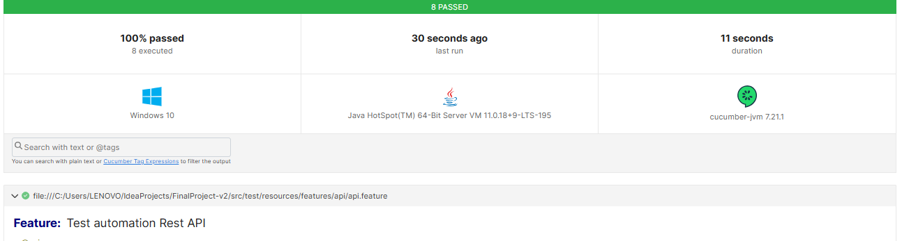
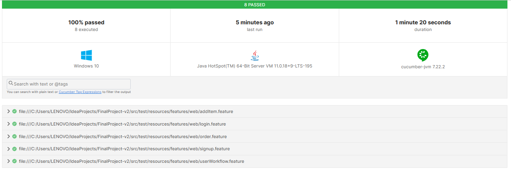

# Automation Test Framework — Web UI & API

## Overview

Project ini merupakan framework automation testing menggunakan Java yang menggabungkan pengujian Web UI dan API dalam satu repository. 
Dengan pendekatan BDD menggunakan Cucumber dan struktur POM, framework ini memastikan kode maintainable dan reusable.
Pengujian API divalidasi secara menyeluruh mulai dari status hingga format response dengan JSON Schema Validation.

Integrasi dengan GitHub Actions mendukung otomatisasi pengujian dalam proses CI/CD sekaligus menyediakan laporan hasil pengujian secara otomatis.
Tujuannya adalah menciptakan solusi testing yang terstruktur, efisien, dan dapat diandalkan untuk meningkatkan kualitas aplikasi secara berkelanjutan.


## Target Applications

- Menguji fungsionalitas Web UI pada situs `demoblaze`
- Menguji RESTful API menggunakan `dummyapi`


## Tools dan library

| Tool/Library           | Fungsi                             |
|------------------------|------------------------------------|
| Java                   | Bahasa pemrograman utama           |
| Gradle                 | Dependency & build management      |
| JUnit                  | Test framework                     |
| Cucumber               | BDD test scenario format (Gherkin) |
| Selenium WebDriver     | Library Web UI automation          |
| Rest Assured           | Library API automation             |
| JSON Schema Validation | Validasi response API              |
| GitHub Actions         | Automasi CI/CD pipeline            |


## Cara Menjalankan Test

1. **Clone repositori:**
   ```bash
   git clone https://github.com/zeeuuu/ui-api-automation-with-cicd.git
   cd ui-api-automation-with-cicd
   ```
2. **Menjalankan semua test**
   ```bash
   ./gradlew test
   ```
3. **Menjalankan test berdasarkan Tag**
- Jalankan test API (@api)
   ```bash
   ./gradlew apiTest
   ```
- Jalankan test Web UI (@web)
   ```bash
   ./gradlew webTest
   ```


## Test Reports

Setelah eksekusi, laporan pengujian otomatis akan tersedia dalam format HTML dan JSON yang tersimpan di folder `/reports/`

API:  `reports/apiTest-report.html`, `reports/apiTest-report.json`

Web UI: `reports/webTest-report.html`, `reports/webTest-report.json`

Silakan buka file HTML untuk melihat hasil pengujian secara interaktif.


## Hasil Pengujian

Hasil Pengujian API


Hasil Pengujian Web UI



## Kontribusi

Jika Anda ingin berkontribusi pada proyek ini, silakan buat fork repositori ini dan kirimkan pull request dengan perubahan Anda.